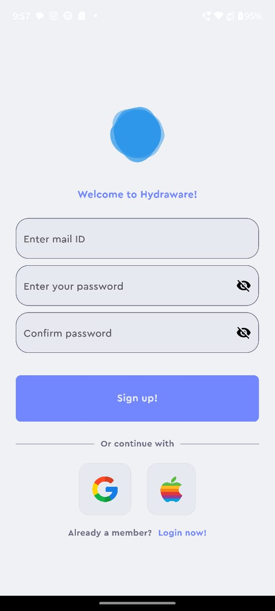
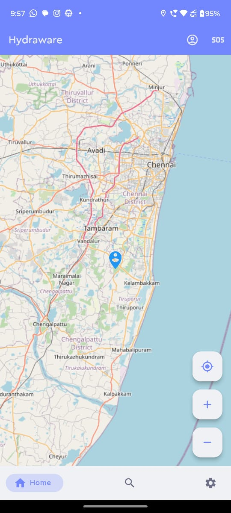
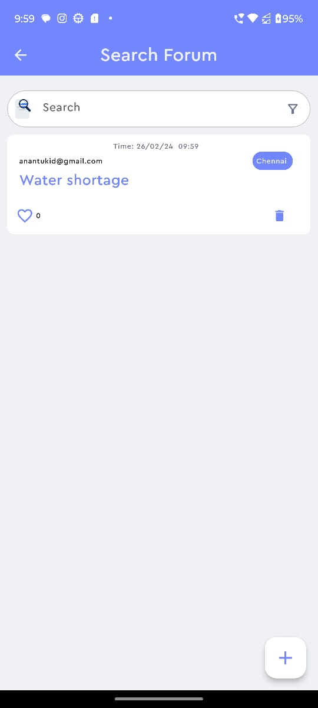
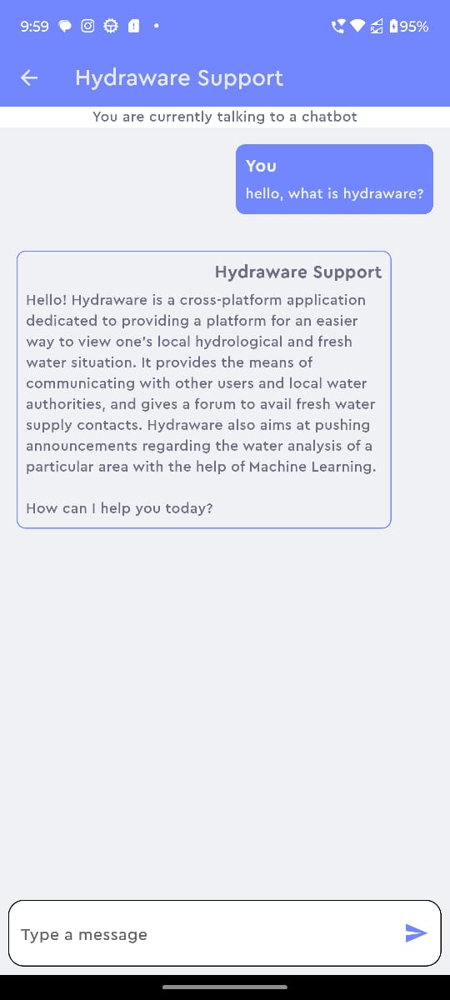
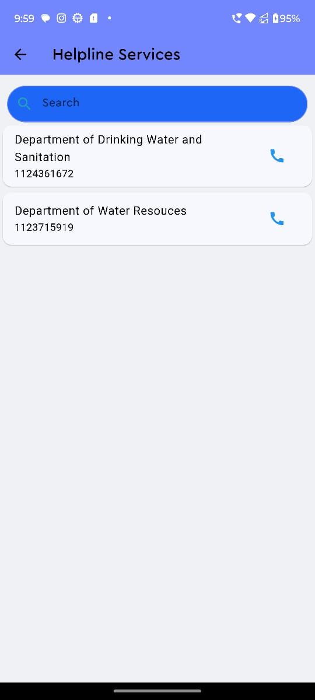

# Hydraware


A cross-platform solution toward a more hydro-knolwedgable world.

## Aim
- To give the user a quick and easy overview of the fresh water supply and hydrological analysis of their locality with the help of governmental organisations like National Institute of Hydrology along with Machine Learning to predict any future shortages
- Effortless access of important announcements through push notifications
- Build a gap between water suppliers and the populace
- Give users an understanding of the water network in their area (includes STP, water processing so on)

Hydraware bridges the gap between water networks and the public, promoting transparency and responsible water use. Imagine understanding your water's journey from source to treatment, participating in discussions about sustainable practices, and receiving alerts about potential outages – all within a single, user-friendly app.

## Future plans

    -Global reach: Expanding beyond a single location to serve users in various regions with diverse water challenges.
    -Additional features: Integrating features like water quality analysis, personalized water-saving recommendations, and gamification elements to encourage sustainable habits.
    -Partnerships: Collaborating with water conservation organizations, educational institutions, and businesses to promote responsible water use.
    -Core features: 1. Machine Learning equipped system to predict freshwater supply in a particular region through local hydrological organisations data
                    2. Multilingual support to ensure the reachability of the app to non-native English speakers
                    3. Set up of SOS emergency helpline numbers with the partnership of local authorities and services
                    4. Setting up an easy-to-access information window of all freshwater suppliers in an area with their contact details


## Social impact:

    -Advocacy platform: Integrating features to raise awareness about water-related issues and encourage users to participate in advocacy efforts.
    -Community action: Facilitating collaboration between users and local organizations to address water challenges in their areas.
    -Education and awareness campaigns: Partnering with educational institutions to develop educational content about water conservation and sustainability.


## Stack Required
- Flutter 3.16
- Dart
- Firebase
- OpenStreetMaps

## Initial Survey and Product Feasibility Research

https://forms.gle/HoFUQtE2LMUAtfDD9


## Survey's takeaways
- The need for an easy-to-access platform to convey the information and knowledge regarding the hydrological activities present in a locality
- The need to bridge the communication gap between governamental bodies and habitants of an area
- An overall movement to help raise more awareness and fact-binded information to a wide audience

## Features
- Uses Gemini API to initialize Hydraware Customer Support Bot
- OpenStreetMap integration to view your current location and future applications with ML for freshwater availability predictions.
- FirebaseAuth and FirebaseFirestore implementation for easy authentication process and db management
- Search Forum for users to post issues in their locality, contains an upvote feature that will give the authorities an idea on the severity of the issue
- SOS feature that will provide with immediate helpline numbers (like the locality's hydrological commision or freshwater maintainer) in case of great distress
- Future ambitions of the app like ML integration to show the hydro-map of the locality to much more!

<table>
  <tr>
    <td></td>
    <td></td>
    <td></td>
  </tr>
</table>

<table>
  <tr>
    <td></td>
    <td></td>
  </tr>
</table>


## Installation
### Prerequisites:
- Git
- Flutter/Dart
- Firebase CLI


1. Clone this repository `https://github.com/nots1dd/Hydraware.git` into your Text-Editor (like VS Code) with the command ```git clone https://github.com/nots1dd/Hydraware.git```
2. Upon cloning, ensure all dependencies are taken care for by `flutter pub get` and assets are all in your local machine.
3. Now run ```flutter run doctor``` to check if everything is fine.
4. If everything is sorted till now, just hit the run button in your Text-Editor, or just ```flutter run```

## Contribution Guide
Although the application is still not fully completed yet, you can contribute to Hydraware by:
- Cloning this repository `https://github.com/nots1dd/Hydraware.git`
- Configuring your own Firebase Console before running

## Keynotes
- Data Privacy and secutiry of users is assured with Firebase's security rules, and more will be done to ensure a digitally safer architecture for all users and potential stakeholders.

## Credits
-[Siddharth Karanam](https://github.com/nots1dd)

-[Ananta Krishnan](https://github.com/OneRandom1509)

-[Abhinav Anil](https://github.com/Sasikuttan2163)

-[Reuben Philip](https://github.com/AltSumpreme)
