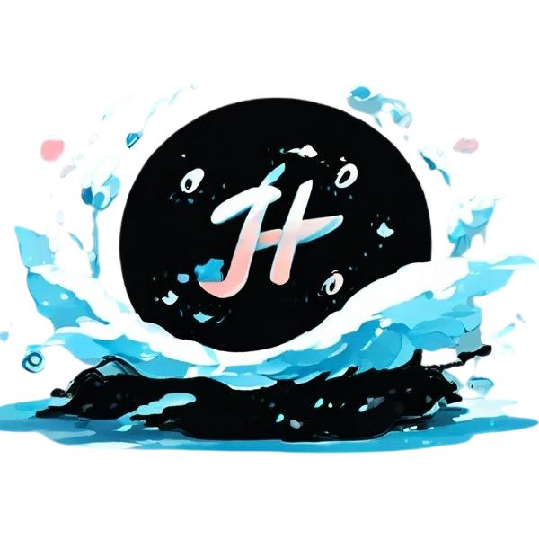

# Hydraware

A cross-platform solution toward a more hydro-knolwedgable world.

## Aim
- To give the user a quick and easy overview of the fresh water supply and hydrological analysis of their locality with the help of governmental organisations like National Institute of Hydrology along with Machine Learning to predict any future shortages
- Effortless access of important announcements through push notifications
- Build a gap between water suppliers and the populace
- Give users an understanding of the water network in their area (includes STP, water processing so on)

Hydraware bridges the gap between water networks and the public, promoting transparency and responsible water use. Imagine understanding your water's journey from source to treatment, participating in discussions about sustainable practices, and receiving alerts about potential outages – all within a single, user-friendly app.

## Future plans

    -Global reach: Expanding beyond a single location to serve users in various regions with diverse water challenges.
    -Additional features: Integrating features like water quality analysis, personalized water-saving recommendations, and gamification elements to encourage sustainable habits.
    -Partnerships: Collaborating with water conservation organizations, educational institutions, and businesses to promote responsible water use.

## Social impact:

    -Advocacy platform: Integrating features to raise awareness about water-related issues and encourage users to participate in advocacy efforts.
    -Community action: Facilitating collaboration between users and local organizations to address water challenges in their areas.
    -Education and awareness campaigns: Partnering with educational institutions to develop educational content about water conservation and sustainability.

## Stack Required
- Flutter 3.16
- Dart
- Firebase
- OpenStreetMaps
- Gemini API

## Initial Survey and Product Feasibility Research

https://forms.gle/HoFUQtE2LMUAtfDD9

## Credits
-[Siddharth Karanam](https://github.com/nots1dd)

-[Ananta Krishnan](https://github.com/OneRandom1509)

-[Abhinav Anil](https://github.com/Sasikuttan2163)

-[Reuben Philip](https://github.com/AltSumpreme)